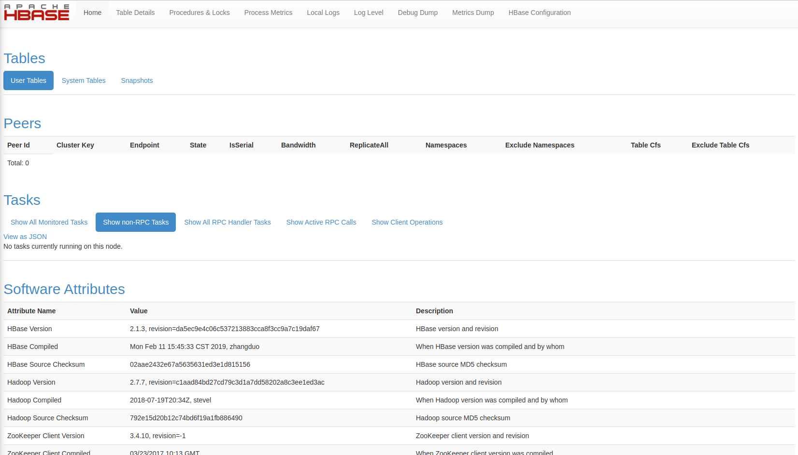
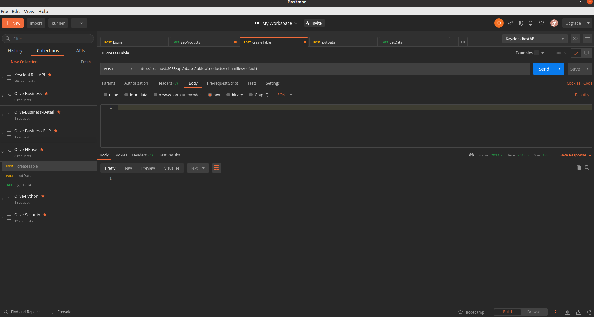
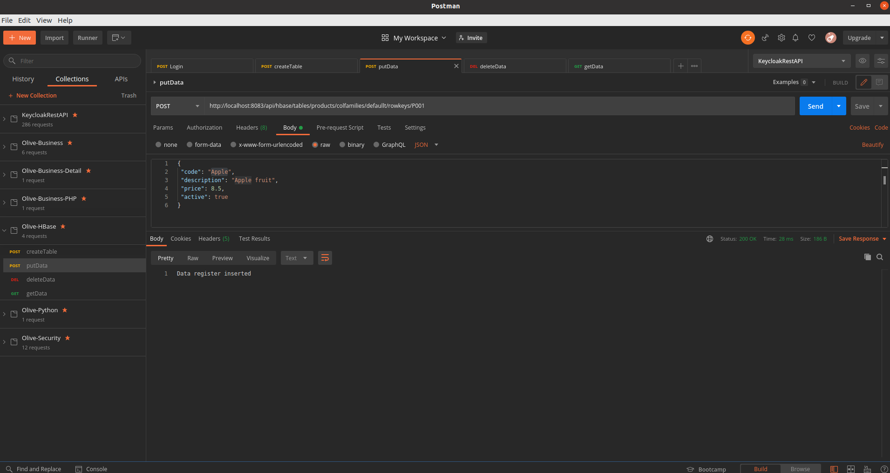
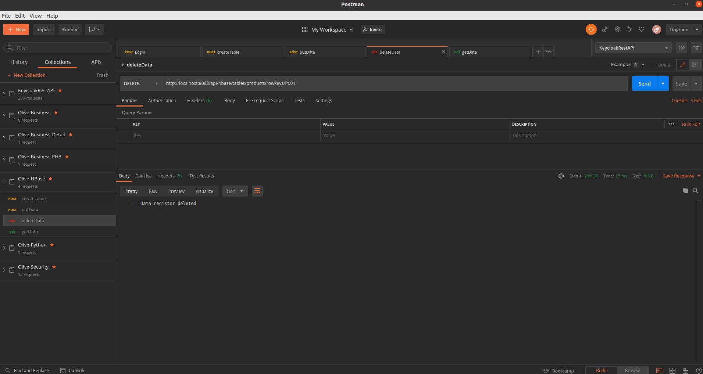
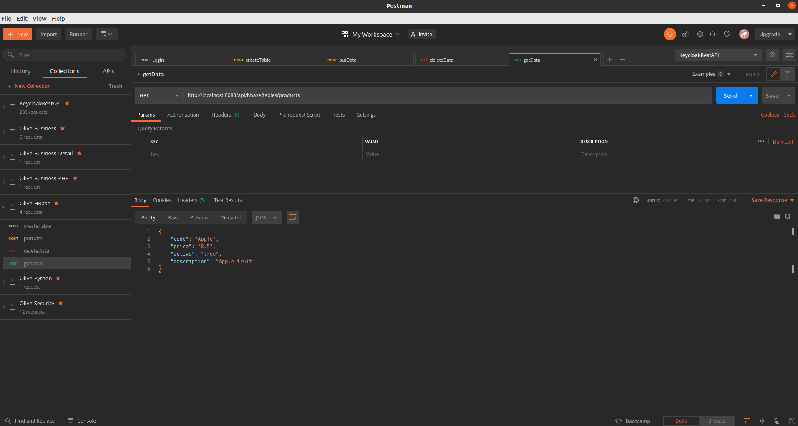

# Description

PoC Olive Backend HBase

## Start HBase environment

```shell
docker run -d --name hbase -p 2181:2181 -p 16010:16010 -p 16020:16020 -p 16030:16030 harisekhon/hbase
```

## Start HBase WebUI 

```shell
http://localhost:16010

```




## Springboot configurations

 Although it is simple to build hbase environment through docker, there is a problem that its host mapping directly uses the container ID. therefore, if our external java program needs to connect to hbase, we need to add the container ID to the host list of our machine
 
## Create a table

From endpoint createTable pass these attributes:

- tableName: table name
- colFamily: Column Family name



## Insert a register in a table

From endpoint createTable pass these attributes:

- tableName: table name
- colFamily: Column Family name
- rowkeys: Unique key row
- In the body: set all columns/values to be inserted



## Remove a register

From endpoint putData pass these attributes:

- tableName: table name
- rowkeys: Unique key row



## Get all registers from a table

From endpoint getData pass these attributes:

- tableName: table name

